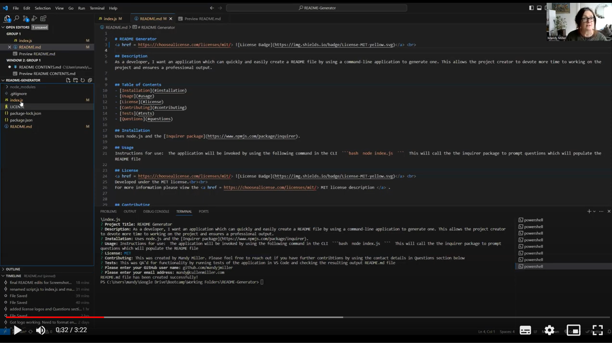

# README Generator
<a href = https://choosealicense.com/licenses/mit/> </a> <br>

## Description
As a developer, I want an application which can quickly and easily create a README file by using a command-line application to generate one. This allows the project creator to devote more time to working on the project and ensures a professional output.


## Table of Contents
- [Installation](#installation)
- [Usage](#usage)
- [License](#license)
- [Contributing](#contributing)
- [Tests](#tests)
- [Questions](#questions)

## Installation
Instructions for use:  The application will be invoked by using the following command in the CLI  ```bash  node index.js  ```  This will call the the inquirer package to prompt questions which will populate the README file

## Usage
Uses node.js and the [Inquirer package](https://www.npmjs.com/package/inquirer).

This video link will demonstrate a walkthrough of the application:

<a href = 'https://drive.google.com/file/d/185zTHgKL1Y3cBbUL8oOUupMlCTyGPN3D/view?usp=sharing'> </a>


## License
<a href = https://choosealicense.com/licenses/mit/> </a> <br>
Developed under the MIT license.<br><br>
For more information please view the <a href = https://choosealicense.com/licenses/mit/> MIT license description </a> .


## Contributing
This was created by Mandy Miller. Please feel free to reach out if you have further contribtions by using the contact details in Questions section below

## Tests
This was QA'd for functionality by running tests of the application in VS Code and checking the resulting output README.md file

## Questions

For further infomation, please follow me on GitHub: <a href =https://github.com/mandyjmiller>https://github.com/mandyjmiller</a><br>
or contact me via email at mandy@cullenmiller.com

THANK YOU!

_____________________________________________________________________
